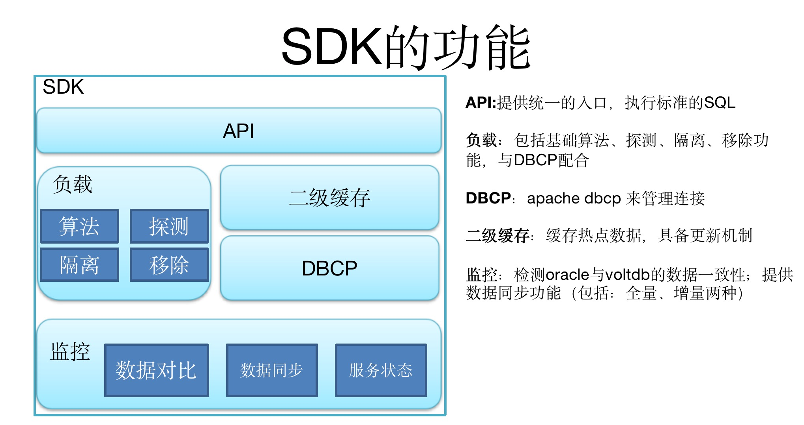
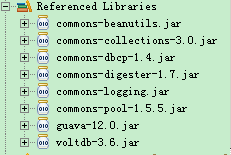
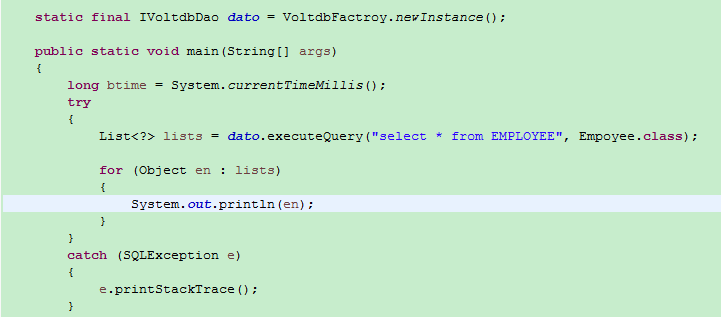
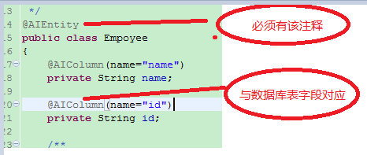
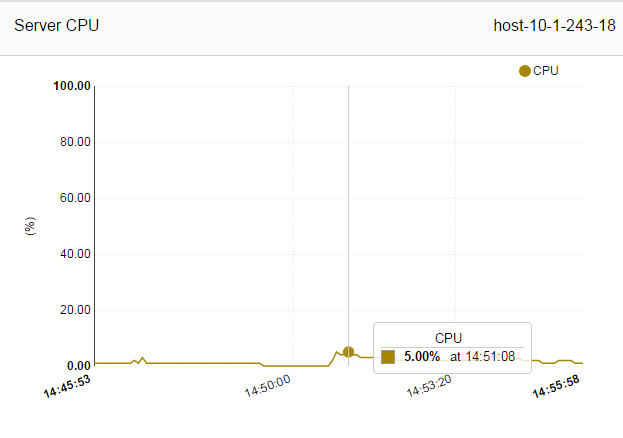
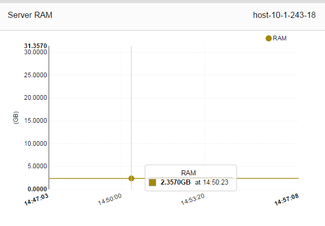
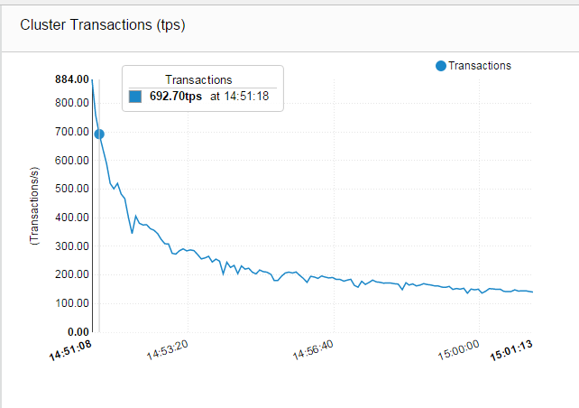
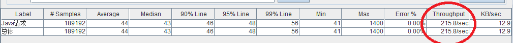

# voltdb_sdk
对VoltDB内存数据库进行特性研究，如存储原理，高可用，数据持久化等。并进行一些基准测试，了解该数据库的性能及吞吐量，并针对该数据库的特性，二次开发数据库SDK，支持负载均衡，LRU二级缓存，数据同步，健康监测，API接口等,暂时不支持事务。  
## VoltBD介绍 
- **高吞吐、低延迟**  
VoltDB能够提供高吞吐、低延迟的SQL操作，总体来说，它是通过内存计算避免磁盘阻塞，通过存储过程避免用户阻塞，通过集群结点内的数据访问串行化，避免传统数据库锁、缓冲管理的开销。此外，VoltDB并不是纯Java开发，其SQL执行引擎是C++写成的，所以并不受GC暂停的影响

- **动态扩展**  
VoltDB属于shared nothing架构，因此可以很容易地实现扩展，可以通过增加已存在结点的容量和性能实现垂直扩展，通过动态增加新结点实现水平扩展，而在这个过程中不需要修改任何数据库schema和应用程序代码  ----  商业版的特性

- **高可用性**  
VoltDB提供三种能力：K-safety，网络故障检测，存活结点重连(rejoin)

- **持久化**  
尽管VoltDB的高可用性能够降低当机概率，但故障还是偶尔会发生，而且DBA有时也要定期地停机维护。因此，VoltDB提供了高性能的快照和命令日志(command log)来支持各种持久化需求----  商业版的特性
  
[更多内容查阅VoltDB官网](https://www.voltactivedata.com/)  

## SDK架构设计  
  

## How To Use 
- 添加环境变量：export VOLTDB_CFG=/home/xxx/dbconfig.xml
- 在上面配置文件中,修改DB配置,参考 config/DBConfig.xml
- 引入lib依赖  
    
- 执行  
    
- POJO 注意:在创建数据库实体的时候需要使用特定的注解  
    

## 基准测试
**系统参数**  
| **操作系统**  | **物理cpu个数/核心数/线程数**  | **内存**  | **sitesperhost**  |**kfactor**   |
| :------------ | :------------ | :------------ | :------------ | :------------ |
|CentOS 6.X (虚拟机)|0/0/8|3G|6|0|  

**测试用例**
采用了JDBC、JAVA Procedure 两种接口方式进行的测试  
A、逐条插入，50个线程  
B、批量插入，50个线程，吞吐量在每秒  

**测试报告**  
- cpu  
    
- 内存  
    
- 吞吐量  
    
- Jmeter测试结果  
      
  
**测试结论**  
- A、逐条插入，50个线程，吞吐量在每秒： 300条到700条，从结果上看不稳定；随着运行的时间，吞吐量减少。  
- B、批量插入，50个线程，吞吐量在每秒：1150条左右，从结果上看稳定，不会随运行时间而变化  
- 线程多少，没过多验证；若以批量的方式会例，吞吐量肯定是线程数增加而增加  

